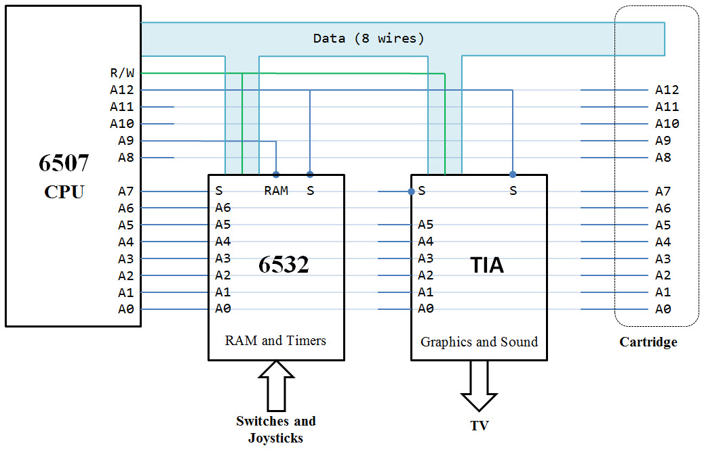
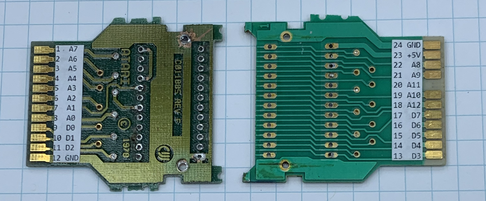
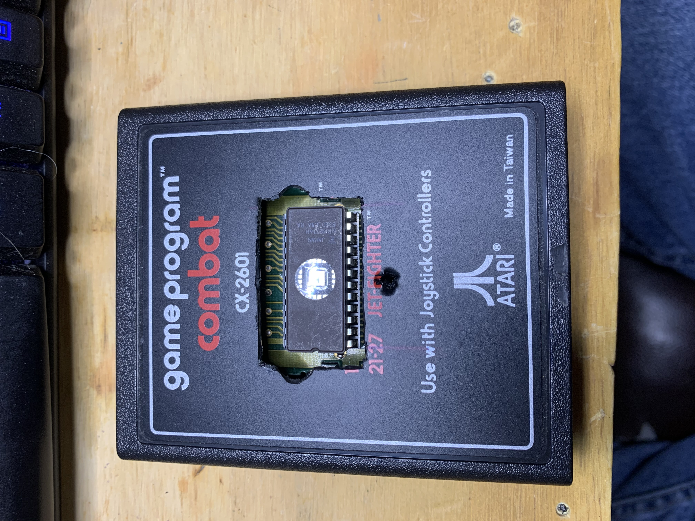

# Chapter 2: The Atari 2600

## Address Line A12

There is nothing particularly exciting about address line A12. He lives an uneventful 
life concealed in the shadows of his big brothers A13, A14, and A15. They are the ones 
who do the heaving decoding on the address bus. We often see A15 working alone to neatly 
cleave the address space into two 32K blocks – one for RAM and one for ROM. Or we find 
the three significant siblings driving a 74138 3-to-8 decoder. Together they partition 
the address space into eight blocks of 8K addresses each. Eight blocks are plenty of 
decoding for RAMs, ROMs, and I/O devices.

Poor address line A12? He is an awkward middle child down at the 4K divider. He might 
rarely be called in to divide an 8K block into two pieces. But more often you will find 
A12 and his smaller brothers serving as indexes within a chip selected by the upper lines. 
Got an 8K RAM or ROM? Then you will certainly need A12. 

But I/O devices are where all the excitement is, and those chips never have enough addresses 
to need A12. Poor A12 is stuck minding the internal RAM and ROM while the little brothers and 
sisters are talking to the cool external ports. In fact, the littlest sibling A0 is the center
 of attention. She is part of every address access.

All that changed in 1977 when Atari released the Atari2600. 

The 6502 was a $25. The 6507 was a reduced cost/functionality. The 6507 and the RIOT chip together 
for $12. The 6507 drops the upper 3 address lines. Total address space is 8K, with our hero 
A12 as the top dog.

https://en.wikipedia.org/wiki/Atari_2600

We saw the R.I.O.T. chip in the last chapter. We'll look at the TIA chip in the next chapter and write 
some graphics. But here we'll run the Atari2600 headless (no TV) and twiddle some I/O lines – just 
our friend the RIOT.

6507 ... limited pins

A12 ... low for things inside the console and high for things inside the cartridge.

Atari2600 memory map -- just three chips plus the external rom.

RIOT chip is used in a lot of things. We used it in the last chapter. TIA ... a little discussion
on that magic in the next chapter.

Need RAM to be lower 00 and lower 100. Show the stack ghosting.

## Making a cartridge

Hacking a 4K cartridge. Show 2K Combat was missing a trace.

[] cartridges after disassembly

Need changes for A12 inverted.

[] schematic for changes
[] modified cartridge with EPROM

Blinking a light through the joystick port (headless).

[] modified cables

## Bank switching

Breadboard breakout. 13-input AND

## RAM

The m-systems game BurgerTime

